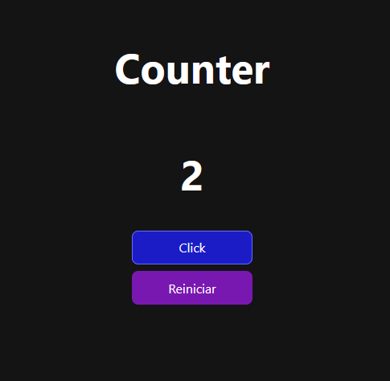
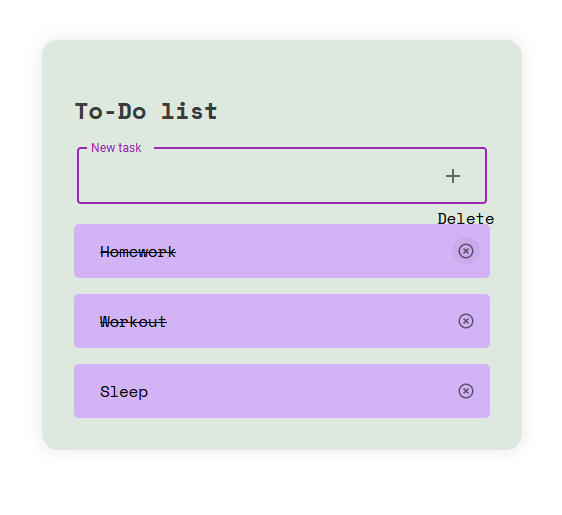
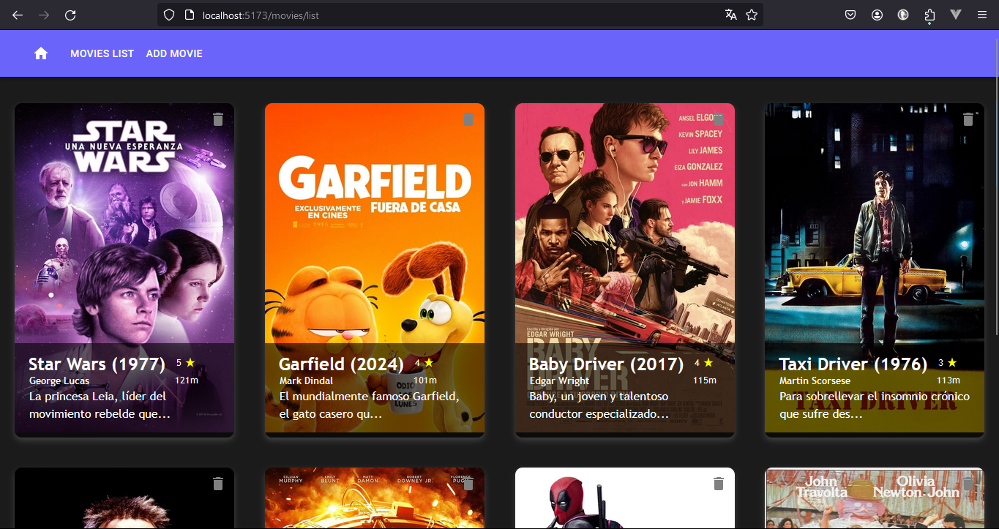

# M6_UF4
 UF4. Comunicació asíncrona client-servidor

### Counter

Component d’un comptador. Tindrà dos botons, un de clicar i un de reiniciar. En fer click
incrementarà el valor, en reiniciar es tornarà a posar a 0.

### Llistat de tasques

Llista de tasques amb un formulari per afegir-ne.

Cada tasca es pot eliminar o modificar el seu estat a completada.

### Projecte Movies: React + Firebase

Aplicació Web que serveix per a afegir películ·les a la colecció movies de Firebase i llegir les dades  

